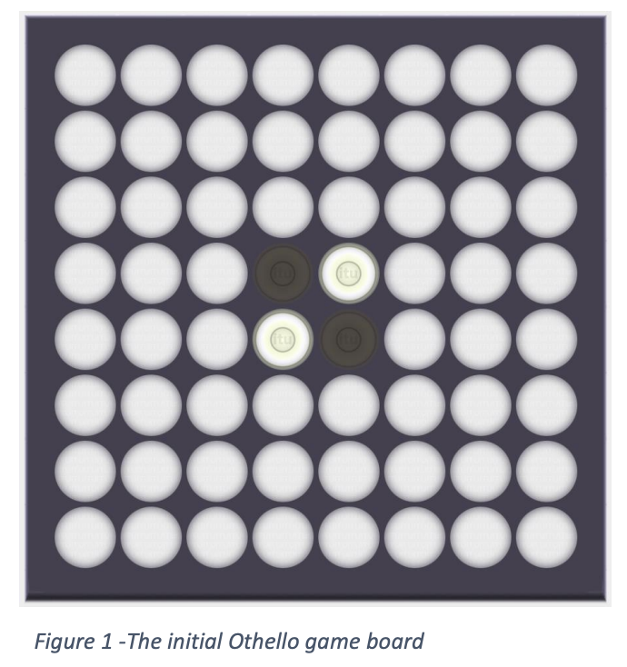

# IAI Project 1 - Othello

## Your Task

In groups of 3-4 you are going to make your own1 implementation of an adversarial search algorithm for the game Othello (rules described below). Preferably, the game should be implemented in Java and otherwise in C#; if you have other language-preferences, you should talk to the TAs to have it approved. It is required that you implement the Minimax-algorithm with alpha-beta pruning. The computer’s response time on a board with 8 columns and 8 rows should be ”reasonable”, meaning that on average, response time should be less than 10 seconds although few moves up to 30 seconds would be acceptable. Moreover, your implementation should be able to beat the provided DumAI consistently. To achieve this, you may need to apply several of the tricks described during lecture for designing the evaluation and cut-off function.

## What is provided

You are provided with five classes and an interface. You do not have to change anything in these classes/interfaces. In fact, we recommend that you do not change anything in these classes. The classes are:

- OthelloGUI. A GUI class that shows the game board and listens for input from the human player in order to place tokens on the board.
- GameState. A class to represent the state of the game, i.e. the board and whose turn it is. It has methods e.g. for finding the possible legal moves and inserting a token at a specified position.
- Position. A small class to represent a position (column and row) on the game board.
- IOthelloAI. The interface that you need to implement. It only has one method, namely decideMove, which takes a GameState as a parameter. Based on that information, you need to decide what move the player in turn should make, i.e. at which position it should place a token.
- Othello. This is the class with the main-method. It reads in the provided parameters, and starts the game. It (hopefully!) gives reasonable feedback if you do not provide it with the required parameters; these are described a little further below.
- DumAI. A simple implementation of the required interface. It return the first possible move that it finds.

Read the code and documentation of the class GameState carefully as you may want to use the provided methods for your implementation of IOthelloAI. If you implement in Java, you do not need to read/understand the code of OthelloGUI or Othello (but of course, feel free to do so). Otherwise, i.e. if you implement in C#, you have to implement similar classes and document how to use them.

For convenience, players are represented with integers, specifically

- 1 = player 1 = the human/your AI’s opponent = black.
- 2 = player 2 = your AI = white.

Similarly, the game board itself is represented in GameState by a 2-dimensional integer array, where the values should either be: 0 (empty), 1 (player 1), or 2 (player 2).

When starting the game (see instructions further below), the game board should look like the one in Figure 1.

The columns on the board are numbered from left to right with the numbers from 0 to 7 (on an 8x8 board), while the rows are numbered from top to bottom with the numbers from 0 to 7 (on an 8x8 board). I.e., the top-most white token in Figure 1 is on position (4,3).

1 Of course, there are various implementations to be found on the internet, but do make you own implementation. If found out, copying is reason for exclusion from the course.

Figure 1 - The initial Othello game board



# Running the game

## Setup

Download the provided files. Setup a project folder as you would usually do. In what follows, let’s assume you call it “OthelloProject”. In order to show the images correctly, it is important, that “OthelloProject” has a subdirectory called “imgs” which contains the images (just as it is in the folder you downloaded).

## Parameters

The main method accepts 3 parameters from the command-line. These are as follows:

1. The first player, which is either a human player (indicated by writing ‘human’), or an AI, specified by the name of a class implementing IOthelloAI.
2. An AI specified by the name of a class implementing IOthello.
3. The size of a quadratic game board. This should be an even number greater or equal to 4. This parameter is optional and defaults to 8 if not specified.

Test that things are set up properly by running Othello with the following parameters: ‘human DumAI’. Either do this from your IDE or by opening a command prompt, go to “OthelloProject”’s directory and write

```
java Othello human DumAI
```

(or you might have to include ‘–cp .’ i.e. write `java –cp . Othello human DumAI`).

This command will create a default 8x8 game board, where a human is player 1 and DumAI is the AI/player 2. The ‘human’ argument is a special keyword which activates mouse clicks for a human player. If you would like to play two logics against each other you just have to replace the keyword ’human’ with the IOthelloAI implementation of your choice. The game parameters also allow you to define the size of the game board, e.g. if I would like to play ’AI1’ against ’AI2’ on a 6x6 game board (where ‘AI1’ starts) you can run the game in the following way:

```
java Othello AI1 AI2 6
```

Figure 1 - The initial Othello game board

# Playing

Start the game by running Othello as described above. The human player (you) always plays first, so you need to click on a legal position on the board (see rules). If you choose an illegal position, you are prompted to make a new move. Otherwise, your token is placed. When you click again, the AI is asked to decide where to place a token. If an illegal position is chosen, an error message pops up and tells you to debug. Otherwise, the token is placed (by the GUI), and the game continues. At a given time in the game, it is possible, that you cannot make a move in which case you are told so. Likewise, it might be the case that the computer cannot make a move, which means that it is your turn again, and you are told so.

If you have chosen two AIs to play against each other, you need to click each time one of the AIs should make a move.

# Rules

The rules of Othello are described here https://www.wikihow.com/Play-Othello. We use the version, where the game ends when none of the players can make a move. Normally, this is because the board is full, but it can also happen earlier in the game. Also notice that a player must make a move, if a legal move exists, even if the player would rather like to pass.

You can download one of the many free Othello apps to make sure you understand the rules.

# Hints

It is natural to evaluate a game state by simply counting the number of discs of each colour. You should notice, though, that some positions are more valuable to capture than others. The URL above discusses some of the basic strategies of the game that can help you make a strong evaluation function.

# Practical advise

Experiment with the cut-off depth of the algorithm together with your evaluation function to examine the possible trade-off between longer calculation time and ”smarter” moves. Develop your code incrementally. Start with the minimax algorithm and be sure this works on a small game board. Then you can proceed with the alpha-beta search and later the evaluation function. Before applying the evaluation function in your main search, check that your evaluation function returns the expected utilities. If you find it too tiresome to test-play against your AI, remember the option to play against another AI. You can for example use DumAI to choose a legal move or change it to return a random move.

# Hand-in

You should hand in the following:

- Compilable and runnable source code with useful/clarifying comments in Java or C#. Only provide classes that you have written yourself. I.e. do not resubmit the code for e.g. GameState unless you changed it (which, again, we strongly suggest you don’t).
    - Running time of computer’s move in average less than 10 seconds.
- A report on 2-3 pages explaining your solution.
    - Explain evaluation and cut-off function.
    - Explain search algorithm.

Your hand-in and your OthelloAI should be named after your group. That is, if you are group number 13, then please call your AI-class “OthelloAI13”. The report (and/or folder with your hand-in) should also contain the words “Othello” and your group number.